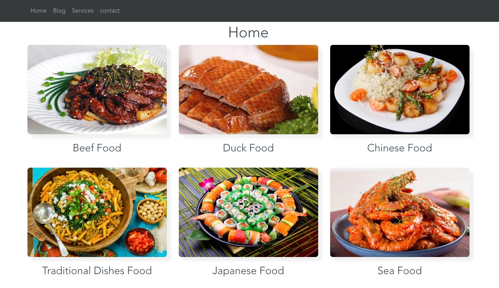
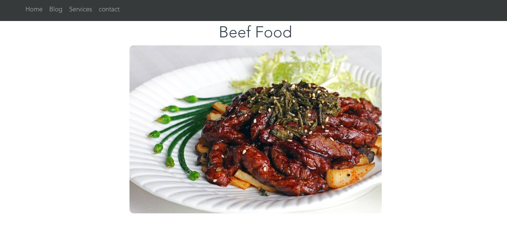

<div align="center">
  
</div>

<div align="center">
  
</div>


> A Vue.js project

## Build Setup

``` bash
# install dependencies
yarn global add @vue/cli

# Create a project
vue create vue-router

cd vue-router

# serve with hot reload at localhost:8080
npm run dev

# build for production with minification
npm run build

# build for production and view the bundle analyzer report
npm run build --report
```
